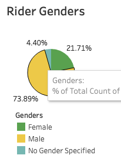
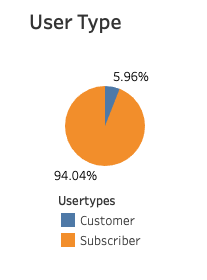

# CitiBike-Analysis

# Background

Analyzed and brokedown data from Quarter 1 of 2019 from [Citi Bike's](https://www.citibikenyc.com/system-data) website. Downloaded the three CSV files necessary and merged them together. 

# Citi Bike Locations

 
  
 * Based off the provided latituted and longituted of the biki stations, the data shows that the vast majority of stations are located in the heart of NYC. 
  
  

 
  
  * The customer base was overwhelmingly male for Q1 of 2019 for Citibike

 
  
  * ~94% of riders for this timeframe were subscribers to the Citi Bike program. 
